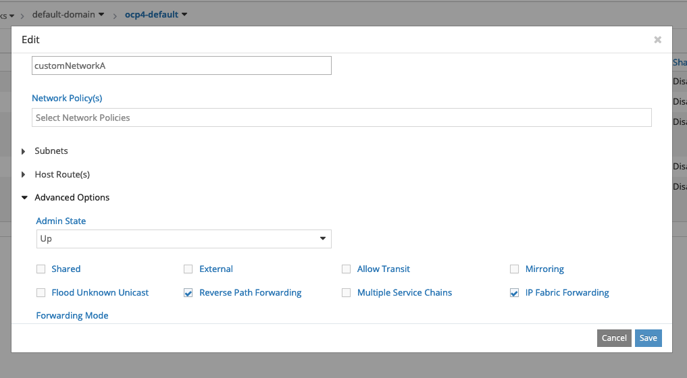
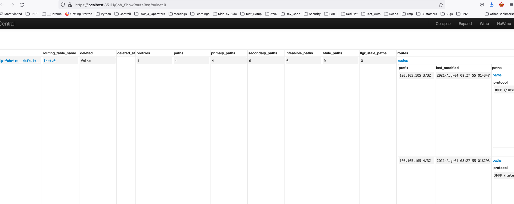
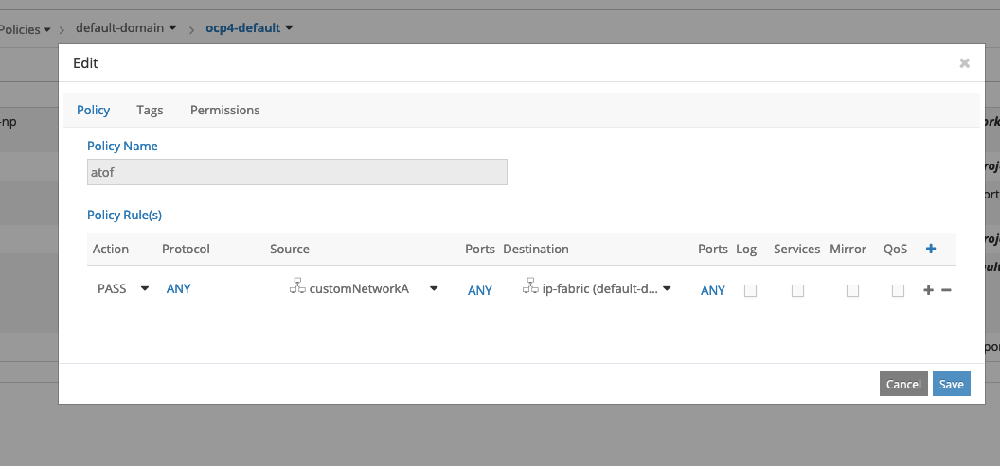
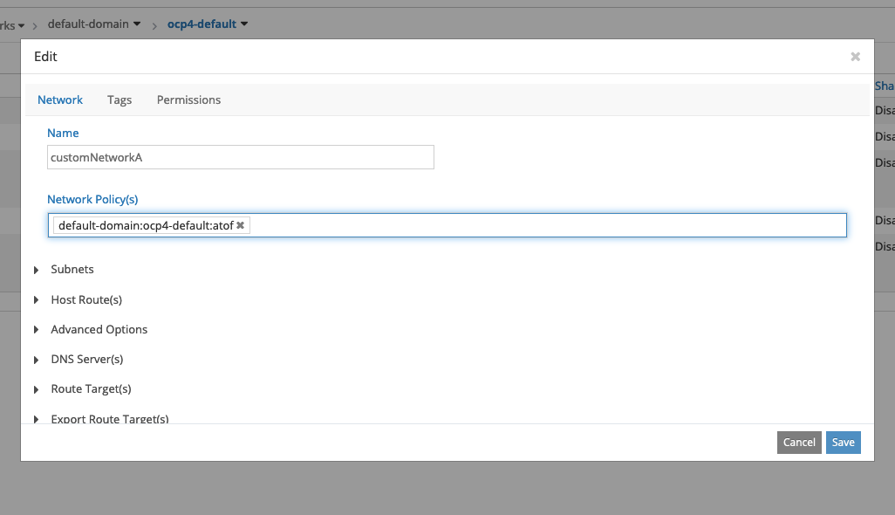

# Fabric Forwarding

  This contrail usecase helps Overlay workloads(VM/Pods) part of Virtual-network to communicate with Underlay network nodes/resources without using SDN-Gateway(MX). Once enabled on VN, it works by leaking the VN routes into Fabric default routing table. As also advertized through BGP and so traffic works across multiple Vrouter nodes in the cluster. As lookup and forwarding done at Fabric Default routing table, so there is **no** Overlay MPLS tunnels etc and works by simple IP based forwading.
  
  Incase of Contrail/K8S solution, this can also be used as alternative to policies to enable reachability across multiple Custom VN workloads and Isolated Namespace workloads by enabling "Fabric Forwarding" on them.
  
  Below highlights the Fabric forwarding scenario involving Custom VN workloads and its implementations demonstrated with reference to outputs captured from Control Node introspects and Vrouter-agent routing-tables,
  
  ```
  [root@helper ocp4]# oc get pods -o wide
NAME                READY   STATUS    RESTARTS   AGE     IP               NODE                       NOMINATED NODE   READINESS GATES
ubuntu-custom-a-1   1/1     Running   0          3d5h    105.105.105.3    worker2.ocp4.example.com   <none>           <none>
ubuntu-custom-b-2   1/1     Running   0          2d22h   115.115.115.4    worker0.ocp4.example.com   <none>           <none>
[root@helper ocp4]# 

  [root@helper ocp4]# oc get nodes -o wide
NAME                       STATUS   ROLES    AGE     VERSION           INTERNAL-IP    EXTERNAL-IP   OS-IMAGE                                                       KERNEL-VERSION                 CONTAINER-RUNTIME
master0.ocp4.example.com   Ready    master   5d10h   v1.19.0+b00ba52   192.168.7.21   <none>        Red Hat Enterprise Linux CoreOS 46.82.202106181041-0 (Ootpa)   4.18.0-193.56.1.el8_2.x86_64   cri-o://1.19.2-6.rhaos4.6.git686e6d9.el8
master1.ocp4.example.com   Ready    master   5d10h   v1.19.0+b00ba52   192.168.7.22   <none>        Red Hat Enterprise Linux CoreOS 46.82.202106181041-0 (Ootpa)   4.18.0-193.56.1.el8_2.x86_64   cri-o://1.19.2-6.rhaos4.6.git686e6d9.el8
master2.ocp4.example.com   Ready    master   5d10h   v1.19.0+b00ba52   192.168.7.23   <none>        Red Hat Enterprise Linux CoreOS 46.82.202106181041-0 (Ootpa)   4.18.0-193.56.1.el8_2.x86_64   cri-o://1.19.2-6.rhaos4.6.git686e6d9.el8
worker0.ocp4.example.com   Ready    worker   5d7h    v1.19.0+b00ba52   192.168.7.11   <none>        Red Hat Enterprise Linux CoreOS 46.82.202106181041-0 (Ootpa)   4.18.0-193.56.1.el8_2.x86_64   cri-o://1.19.2-6.rhaos4.6.git686e6d9.el8
worker1.ocp4.example.com   Ready    worker   5d7h    v1.19.0+b00ba52   192.168.7.12   <none>        Red Hat Enterprise Linux CoreOS 46.82.202106181041-0 (Ootpa)   4.18.0-193.56.1.el8_2.x86_64   cri-o://1.19.2-6.rhaos4.6.git686e6d9.el8
worker2.ocp4.example.com   Ready    worker   3d7h    v1.19.0+b00ba52   192.168.7.13   <none>        Red Hat Enterprise Linux CoreOS 46.82.202106181041-0 (Ootpa)   4.18.0-193.56.1.el8_2.x86_64   cri-o://1.19.2-6.rhaos4.6.git686e6d9.el8
[root@helper ocp4]# 

  ```
  
### Before enabling "Fabric Forwarding" on VN
  
   In this example, as shown above command outputs of openshift pods/nodes, ubuntu-custom-a-1 launched on customnetworkA virtual-network on worker2 vrouter and ubuntu-custom-b-1 launched on customnetworkB virtual-network on worker0 vrouter. As we know, above launched workloads by default cannot reach Underlay nodes/resources and also as each of the above workloads being part of different VN and they neither reach each other by default as shown below ping tests,
  
  ```
  root@ubuntu-custom-a-1:/# 
root@ubuntu-custom-a-1:/# ping 192.168.7.21
PING 192.168.7.21 (192.168.7.21) 56(84) bytes of data.
^C
--- 192.168.7.21 ping statistics ---
4 packets transmitted, 0 received, 100% packet loss, time 3068ms

root@ubuntu-custom-a-1:/# 
root@ubuntu-custom-a-1:/# ping 115.115.115.4
PING 115.115.115.4 (115.115.115.4) 56(84) bytes of data.
^C
--- 115.115.115.4 ping statistics ---
4 packets transmitted, 0 received, 100% packet loss, time 3088ms

root@ubuntu-custom-a-1:/# 
  ```
  
### After enabling "Fabric Forwarding" on VN

  Let us enable Fabric Forwarding on VN using Contrail UI.  Below shows example for CustomNetworkA VN and same to be repeated for CustomNetworkB VN.
  
  
  
  **Control Node Introspect**
  
  At this point, we could observe the routes are indeed leaked into Fabric Default routing-table as we enabled Fabric forwarding on CustomNetworkA VN. Below Control Node introspect shows it. Below shows example for CustomNetworkA VN and same to be repeated for CustomNetworkB VN.
  
  
  
  **Also Vrouter nodes in the cluster can be seen having leaked-routes installed on Fabric Default routing table for this customNetworkA and customNetworkB VN's as we enabled on them**
  
  ```
  (contrail-tools)[root@worker2 /]$ rt --dump 0 --family inet | grep -v " \+T \+-"
Flags: L=Label Valid, P=Proxy ARP, T=Trap ARP, F=Flood ARP, Ml=MAC-IP learnt route
vRouter inet4 routing table 0/0/unicast
Destination           PPL        Flags        Label         Nexthop    Stitched MAC(Index)
105.105.105.1/32       32           PT          -             13        -
105.105.105.2/32       32           PT          -             13        -
105.105.105.3/32       32            P          -            107        -
105.105.105.4/32       32            P          -            106        -
115.115.115.1/32       32           PT          -             13        -
115.115.115.2/32       32           PT          -             13        -
115.115.115.3/32       32            P          -            124        -
115.115.115.4/32       32           PT          -             25        52:54:0:f4:26:a1(178584)
169.254.0.1/32         32           PT          -              5        -
169.254.0.3/32         32           PT          -             48        -
169.254.0.4/32         32           PT          -             68        -
::
::


(contrail-tools)[root@worker0 /]$ rt --dump 0 --family inet | grep -v " \+T \+-"
Flags: L=Label Valid, P=Proxy ARP, T=Trap ARP, F=Flood ARP, Ml=MAC-IP learnt route
vRouter inet4 routing table 0/0/unicast
Destination           PPL        Flags        Label         Nexthop    Stitched MAC(Index)
105.105.105.1/32       32           PT          -             13        -
105.105.105.2/32       32           PT          -             13        -
105.105.105.3/32       32           PT          -            116        52:54:0:8e:10:34(48012)
105.105.105.4/32       32           PT          -            116        52:54:0:8e:10:34(48012)
115.115.115.1/32       32           PT          -             13        -
115.115.115.2/32       32           PT          -             13        -
115.115.115.3/32       32           PT          -            116        52:54:0:8e:10:34(48012)
115.115.115.4/32       32            P          -             98        -
169.254.0.1/32         32           PT          -              5        -
169.254.0.3/32         32           PT          -             27        -
::
::

  ```
  
  At this point, we have Control Plane & routes converged, but still ubuntu-custom-a-1 traffic failure reaching neither Underlay nodes nor ubuntu-custom-b-2 because we need to configure policy to force traffic from customnetworkA VN to Fabric default routing-table for lookup & forwarding. So, below shows how to configure & enable Policy. Below shows example for CustomNetworkA VN and same to be repeated for CustomNetworkB VN.
  
  
  
  
  
  At this point, we are now ready to see ubuntu-custom-a-1 pod traffic success reaching both Underlay nodes and also ubuntu-custom-b-2 pod ( assuming all the earlier example steps also repeated for CustomNetworkB VN ).  Below shows Traffic success to both Underlay and other customVN,
  
  ```
  root@ubuntu-custom-a-1:/# 
root@ubuntu-custom-a-1:/# ping 192.168.7.21
PING 192.168.7.21 (192.168.7.21) 56(84) bytes of data.
64 bytes from 192.168.7.21: icmp_seq=1 ttl=62 time=1.71 ms
64 bytes from 192.168.7.21: icmp_seq=2 ttl=62 time=0.567 ms
^C
--- 192.168.7.21 ping statistics ---
2 packets transmitted, 2 received, 0% packet loss, time 1001ms
rtt min/avg/max/mdev = 0.567/1.143/1.719/0.576 ms
root@ubuntu-custom-a-1:/# 
root@ubuntu-custom-a-1:/# 
root@ubuntu-custom-a-1:/# ping 115.115.115.4
PING 115.115.115.4 (115.115.115.4) 56(84) bytes of data.
64 bytes from 115.115.115.4: icmp_seq=1 ttl=62 time=1.74 ms
64 bytes from 115.115.115.4: icmp_seq=2 ttl=62 time=0.630 ms
^C
--- 115.115.115.4 ping statistics ---
2 packets transmitted, 2 received, 0% packet loss, time 1001ms
rtt min/avg/max/mdev = 0.630/1.188/1.747/0.559 ms
root@ubuntu-custom-a-1:/# 
  ```
  
  ** Now further vrouter flow tables and NH tables and VIF can proove clearly the traffic takes simple IP forwarding without any MPLS Overlay tunnels etc **
  
  ```
  (contrail-tools)[root@worker2 /]$ flow -l --match 115.115.115.4 
Flow table(size 161218560, entries 629760)

Entries: Created 681942 Added 681942 Deleted 510594 Changed 534969Processed 681942 Used Overflow entries 0
(Created Flows/CPU: 216112 212877 37255 215698)(oflows 0)

Action:F=Forward, D=Drop N=NAT(S=SNAT, D=DNAT, Ps=SPAT, Pd=DPAT, L=Link Local Port)
 Other:K(nh)=Key_Nexthop, S(nh)=RPF_Nexthop
 Flags:E=Evicted, Ec=Evict Candidate, N=New Flow, M=Modified Dm=Delete Marked
TCP(r=reverse):S=SYN, F=FIN, R=RST, C=HalfClose, E=Established, D=Dead

Listing flows matching ([115.115.115.4]:*)

    Index                Source:Port/Destination:Port                      Proto(V)
-----------------------------------------------------------------------------------
   159376<=>409632       115.115.115.4:242                                   1 (0)
                         105.105.105.3:0    
(Gen: 21, K(nh):107, Action:F, Flags:, QOS:-1, S(nh):25,  Stats:2/168, 
 SPort 64703, TTL 0, Sinfo 0.0.0.0)

   409632<=>159376       105.105.105.3:242                                   1 (0)
                         115.115.115.4:0    
(Gen: 22, K(nh):107, Action:F, Flags:, QOS:-1, S(nh):107,  Stats:2/196, 
 SPort 54480, TTL 0, Sinfo 6.0.0.0)

(contrail-tools)[root@worker2 /]$ 
(contrail-tools)[root@worker2 /]$ 
(contrail-tools)[root@worker2 /]$ 
(contrail-tools)[root@worker2 /]$ flow --get 409632
Flow Index:                   409632
Flow Generation ID:           22
Reverse Flow Index:           159376
VRF:                          0
Destination VRF:              0
Flow Source:                  [105.105.105.3]:242  
Flow Destination:             [115.115.115.4]:0    
Flow Protocol:                ICMP
Flow Action:                  FORWARD
Expected Source:              NextHop(Index, VRF, Type): 107, 0, ENCAP
                              Ingress Interface(Index, VRF, OS): vif0/6, 0, tapeth0-2a2230
                              Interface Statistics(Out, In, Errors): 105149, 105391, 0
Source Information:           VRF: 0
                              Layer 3 Route Information
                              Matching Route: 105.105.105.3/32
                              NextHop(Index, VRF, Type): 107, 0, ENCAP
                              Ingress Interface(Index, VRF, OS): vif0/6, 0, tapeth0-2a2230
                              Interface Statistics(Out, In, Errors): 105149, 105391, 0
Destination Information:      VRF: 0
                              Layer 3 Route Information
                              Matching Route: 115.115.115.4/32
                              NextHop(Index, VRF, Type): 25, 0, ENCAP
                              Egress Interface(Index, VRF, OS): vif0/0, 0, ens3
                              Interface Statistics(Out, In, Errors): 4156619, 4206387, 0

                              Layer 2 Route Information
                              DestinationMAC: 52:54:0:f4:26:a1
                              
Flow Flags:                   
UDP Source Port:              54480

Flow Statistics:              2/196
System Wide Packet Drops:     239948
                              Reverse Path Failures: 0
                              Flow Block Drops: 1064
(contrail-tools)[root@worker2 /]$ 
(contrail-tools)[root@worker2 /]$ 
(contrail-tools)[root@worker2 /]$ 
(contrail-tools)[root@worker2 /]$ nh --get 25
Id:25         Type:Encap          Fmly: AF_INET  Rid:0  Ref_cnt:3          Vrf:0
              Flags:Valid, Etree Root, 
              EncapFmly:0806 Oif:0 Len:14
              Encap Data: 52 54 00 f4 26 a1 52 54 00 8e 10 34 08 00 

(contrail-tools)[root@worker2 /]$ 
(contrail-tools)[root@worker2 /]$ 
(contrail-tools)[root@worker2 /]$ 
(contrail-tools)[root@worker2 /]$ vif --get 0
Vrouter Interface Table

Flags: P=Policy, X=Cross Connect, S=Service Chain, Mr=Receive Mirror
       Mt=Transmit Mirror, Tc=Transmit Checksum Offload, L3=Layer 3, L2=Layer 2
       D=DHCP, Vp=Vhost Physical, Pr=Promiscuous, Vnt=Native Vlan Tagged
       Mnp=No MAC Proxy, Dpdk=DPDK PMD Interface, Rfl=Receive Filtering Offload, Mon=Interface is Monitored
       Uuf=Unknown Unicast Flood, Vof=VLAN insert/strip offload, Df=Drop New Flows, L=MAC Learning Enabled
       Proxy=MAC Requests Proxied Always, Er=Etree Root, Mn=Mirror without Vlan Tag, HbsL=HBS Left Intf
       HbsR=HBS Right Intf, Ig=Igmp Trap Enabled, Ml=MAC-IP Learning Enabled

vif0/0      OS: ens3 NH: 4
            Type:Physical HWaddr:52:54:00:8e:10:34 IPaddr:0.0.0.0
            Vrf:0 Mcast Vrf:65535 Flags:TcL3L2VpEr QOS:-1 Ref:21
            RX packets:4206935  bytes:1423041956 errors:0
            TX packets:4157137  bytes:8204809926 errors:0
            Drops:21462

(contrail-tools)[root@worker2 /]$ 
  '''
  
  
  


  
  
  
  
  

  
  
